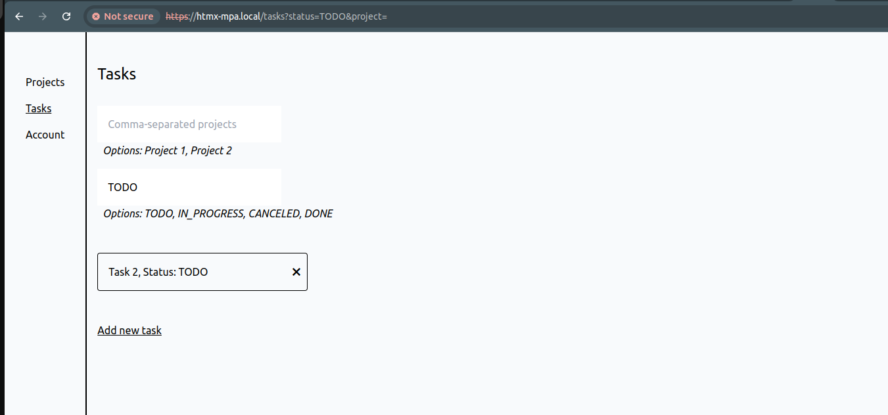

# HTMX MPA vs React SPA

Let's compare the same application, created twice as:
* Multi Page Application (MPA), boosted with HTMX for partial updates
* Single Page Application (SPA), implemented with the help of React

The goal is to compare:
* subjective user experience
* page load speed - how much do we need to wait for the page to be fully visible and functional?
* code complexity
* general tradeoffs of both approaches - nothing is for free!

It's a simple CRUD app that allows to manage projects and associated tasks. It looks something like this:




\
Both versions - Java/HTMX MPA & React SPA - look exactly the same and have identical functionality.

## What is here

* **Server**: Java 21 MPA + API. It implements MPA, serving fully rendered HTML pages with the help of Mustache templates and HTMX, CSS and JS assets. 
 At the same time, it exposes API for the SPA app; it uses SQLite as a database
* **Nginx**: serves as a reverse proxy for our server/api, requests rate limiter, ssl certificates handler and static files server (for SPA)
* **React**: SPA version of the app
* **Scripts**: various utilities to automate/speed up operations - mostly Bash, standard Linux utilities and Python
* **Load Test**: script (Java) to load/performance test both apps and output detailed results

## Some requirements

* Docker for builds and deployments
* Java 21 + compatible Maven version for the server and load-test
* node v20+ for the React app
* DigitalOcean account for running deployment example or just a virtual machine with Docker + ssh access (you might also run it locally)
* Python 3 + Pip to prepare DigitalOcean infra automatically
* Domain to set up HTTPS
* Linux (most likely) and its standard utilities, used by scripts (openssl, envsubst; [server/tailwindcss is also a binary for linux-x64 architecture](https://tailwindcss.com/blog/standalone-cli))

## Infra preparation

From scripts:
```
# create venv, install deps
bash init_python_env.bash
# activate Python env
source venv/bin/activate

export DO_API_TOKEN="<your DigitalOcean api key>"
export SSH_KEY_FINGERPRINT="<fingerprint of your ssh key, uploaded to DigitalOcean>"
python prepare_infra.py
```
This will create a droplet with basic firewall.
It can take up to 3 - 5 minutes for a machine to be fully ready, so be patient!

## Domains & HTTPS setup

In config_prod.env, change:
```
export MPA_DOMAIN="htmx-mpa.nonexistentdomain.com"
export SPA_DOMAIN="react-spa.nonexistentdomain.com"
export DOMAINS_EMAIL="igor@nonexistentdomain.com"
```
...to controlled by you domains/subdomains and email (required by [Let's Encrypt](https://letsencrypt.org/) to generate certificates).
They must be different for Nginx config to work properly.

After modifying it, take IP addresses of freshly created droplet and sign in to your domain provider service - we need to create two DNS A records.

After that, we can generate HTTPS certs by executing this single script:
```
bash set_up_https_certs.bash
```
After a minute or two, we should have two https certs for `MPA_DOMAIN` and `SPA_DOMAIN` accordingly.

## Build & Deploy

Since the infra is ready, we can build all apps and deploy them. To do that, just run (from scripts):
```
bash build_and_package_apps.bash
```

It will build all apps (react, nginx, server) with ready for production setup - it might take a few minutes, if run for the first time.

We also need to generate a secret to sign JWT, for authentication:
```
python3 generate_secrets.py

Go to needed directory and simply run:

echo "gKtXqqKiZVrWXtxDMtisOJ650VD/58Y9PY/U9t4F4gI=" > auth-token-key.txt
```

As the output is saying, we need to be in the desired directory and just copy-paste it there. 
Let's prepare the directory on our remote machine:
```
ssh deploy@<your domain>

# secrets path from config_prod.env
mkdir /home/deploy/.secrets
cd /home/deploy/.secrets

<copy-paste command(s) from the generate_secrets.py output>

ls -l

total 4
-rw-rw-r-- 1 deploy deploy 45 Feb 25 18:27 auth-token-key.txt
```

To deploy all applications (react, nginx, server), run:
```
bash deploy_apps.bash
```

That might also take a few minutes; after it finishes, we are ready for tests!


## User experience tests

Just go to https://MPA_DOMAIN and https://SPA_DOMAIN and see whether you can catch any differences ;) 
Available users are defined in the `DemoDataInitializer.class` file (server dir).

## Load tests

At last, let's run some load tests to see performance differences; most importantly, how much time does it take do load concrete pages?
Taking all requests - fetching HTML + CSS/JS assets (+ fetch for SPA) - into consideration.

We will need to have current js and css files path that can be taken from the browser; like:
```
# SPA
assets/index-S7e9TcxU.js
assets/index-S7e9TcxU.css

# MPA
js/htmx.2.0.4.min.js
styles_0fa10b700026d18a.css
```
We also need `TOKEN` var, taken from cookies:


Then, from the `load-test` directory we might run MPA test case:
```
export HOST=https://<mpa-domain>
export TEST_CASE=MPA
export MPA_JS_PATH=<mpa-js-path>
export MPA_CSS_PATH=<mpa-css-path>
export TOKEN=<token from cookies of mpa-domain>

java MpaVsSpaLoadTest.java
```

After making 2000 requests in 20 - 25 seconds (100 rps), we can see some results:
```
Starting MpaVsSpaLoadTest!

Test case: MPA
About to make 2000 requests with 100/s rate to https://htmx-mpa.binaryigor.com host
Timeouts are 5000 ms for connect and 5000 ms for request
Max concurrency is capped at: 200

Endpoints to test (chosen randomly):
GET:js/htmx.2.0.4.min.js
GET:styles_cb92397d6961a772.css
GET:projects
GET:tasks
GET:account

...

2025-02-25T20:13:00.034533856, 100/2000 requests were issued, waiting 1s before sending next batch...
2025-02-25T20:13:01.036568961, 200/2000 requests were issued, waiting 1s before sending next batch...

...

2025-02-25T20:13:17.225227177, 1800/2000 requests were issued, waiting 1s before sending next batch...
2025-02-25T20:13:18.243508946, 1900/2000 requests were issued, waiting 1s before sending next batch...

...

2000 requests with 100 per second rate took PT20.4S

...

Executed requests: 2000, with 100/s rate
Requests with connect timeout [5000]: 0, as percentage: 0
Requests with request timeout [5000]: 0, as percentage: 0

Min: 0.022 s
Max: 0.406 s
Mean: 0.034 s

Percentile 50 (Median): 0.028 s
Percentile 75: 0.031 s
Percentile 90: 0.035 s
Percentile 95: 0.043 s
Percentile 99: 0.263 s

...

Endpoints:

...

Pages:

Projects = (worst of: GET:js/htmx.2.0.4.min.js, GET:styles_cb92397d6961a772.css) + GET:projects

Min: 0.047 s
Max: 0.741 s
Mean: 0.065 s

Percentile 50 (Median): 0.055 s
Percentile 75: 0.059 s
Percentile 90: 0.068 s
Percentile 95: 0.081 s
Percentile 99: 0.431 s

...

Account = (worst of: GET:js/htmx.2.0.4.min.js, GET:styles_cb92397d6961a772.css) + GET:account

Min: 0.046 s
Max: 0.775 s
Mean: 0.066 s

Percentile 50 (Median): 0.054 s
Percentile 75: 0.058 s
Percentile 90: 0.07 s
Percentile 95: 0.088 s
Percentile 99: 0.459 s

...

Tasks = (worst of: GET:js/htmx.2.0.4.min.js, GET:styles_cb92397d6961a772.css) + GET:tasks

Min: 0.047 s
Max: 0.759 s
Mean: 0.068 s

Percentile 50 (Median): 0.055 s
Percentile 75: 0.06 s
Percentile 90: 0.07 s
Percentile 95: 0.084 s
Percentile 99: 0.536 s

...

```

To repeat this case for SPA, run:
```
export HOST=https://<spa-domain>
export TEST_CASE=SPA
export SPA_JS_PATH=<spa-js-path>
export SPA_CSS_PATH=<spa-css-path>
export TOKEN=<token from cookies of spa-domain>

java MpaVsSpaLoadTest.java
```

\
Having both objective tests and user experience results, we are able to judge which one is better and why!
