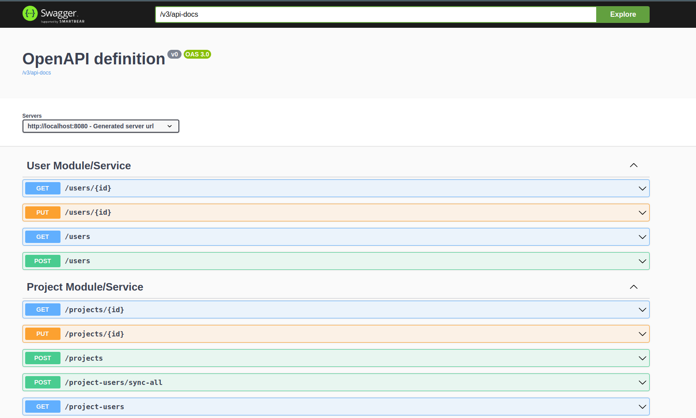

# Modular Monolith or Microservices Pattern

What if we have a pattern, where depending on our current needs,
we can run modules in a single application (monolith) or multiple applications - (micro) services?

## What is here

* Postgres 16, Java 21 + Maven + Spring Boot modules/services
* ops - set of scripts to facilitate operations
* modules or services, depending on our choice:
    * `user` - manages users
    * `project` - manages projects that have users
    * `shared` - code shared between modules (user & project) - they can depend only on it, but never directly on each
      other
    * `modular-monolith` - monolith that depends on user and project modules and runs them in a single runtime (
      application)

Additionally, both `user` and `project` modules can be run as independent services - `user-service` and `project-service`
accordingly.

## Module dependencies

By convention, modules can depend only on the `shared` module and `shared` module is completely independent - it does not
depend on anything.

Modules are constrained by a simple rule:
> While handling external requests, a module must not call another module.


Thanks to it, it is really easy to have a monolith & services setup, because they (modules) are loosely coupled.
The `project` module needs some data from the `user` module, but it is all synchronized in the background.

## Cases

To run them, you need to have:
* Java 21 + compatible Maven version (3.9+ for example) to build apps/modules
* Docker to run them

All scripts must be run from the `ops` directory.

## Case 1 - Modular Monolith

Let's start the database in Docker (Postgres):
```
bash build_and_run_db.bash
```

Let's build the `modular-monolith` with all needed dependencies:
```
bash build_modular_monolith.bash
```

Let's run in it in Docker:
```
bash run_modular_monolith.bash
```

Go to http://localhost:8080/swagger-ui/index.html to see all available endpoints.
Two groups should be available: one from the `user` and another one from the `project` module.


If we do `GET` on both `/users` and `/project-users` we should get empty lists - there is no data available yet.

Before creating some users that will be synchronized with the `project` module, let's play out another scenario:
let's run the `modular-monolith` only with the `user` module, without `project`. 
This is a realistic situation: we might have developed and used this module in production, and we already have some users in the database.
Some time later on, we decided to add the `project` module with new features.
Let's see what problems will arise from this decision.

Building `modular-monolith` without the `project` module:
```
export ONLY_USER_MODULE=true
bash build_modular_monolith.bash
```

Let's run it:
```
bash run_modular_monolith.bash
```

If we go to http://localhost:8080/swagger-ui/index.html again, we will see endpoints only from the `user` module - it
means that the `project` module is not available, which is exactly what we wanted.

Let's create some users, using `Requests.java` script:
```
java Requests.java createUsers
```

Now, if we do `GET: /users` (from Swagger), we should see a few users (Newline Delimited JSON):
```
{"id":"29d376f1-b8a9-4fc5-aec3-7bd33cb02047","email":"user1@email.com","name":"user1","version":1}
{"id":"ceab4eda-79a4-4bda-80fe-ec01593fb51a","email":"user2@email.com","name":"user2","version":1}
{"id":"fd62f5fe-faa6-4fed-8d8c-895a18a08e70","email":"user3@email.com","name":"user3","version":1}
```

Let's build and run the `modular-monolith` again with all modules:
```
export ONLY_USER_MODULE=false
bash build_modular_monolith.bash
bash run_modular_monolith.bash
```

We now have again it with both modules. Let's try to create a project with previously created users, that only the `user` module is aware of:
```
java Requests.java createProject
```

We will get the following error:
```
{
  "type": "ProjectUsersDoNotExistException",
  "title": "ProjectUsersDoNotExistException",
  "status": 404,
  "detail": "Project users of [29d376f1-b8a9-4fc5-aec3-7bd33cb02047, ceab4eda-79a4-4bda-80fe-ec01593fb51a, fd62f5fe-faa6-4fed-8d8c-895a18a08e70] ids do not exist",
  "instance": "/projects"
}
```

The `project` module was not around when we were creating users.

We need to call sync endpoint just this one time to synchronize past events' data.
Go to http://localhost:8080/swagger-ui/index.html and just call `POST: /project-users/sync-all`.

We now have synchronized users, so we can create a project with them:
```
java Requests.java createProject
```

We should get successful response and can now `GET` newly created project, and see it with the users data:
```
{
  "id": "7be242da-8d8e-4c94-8e2d-56fa090c9fd1",
  "name": "project",
  "description": "project-description",
  "users": [
    {
      "id": "fd62f5fe-faa6-4fed-8d8c-895a18a08e70",
      "email": "user3@email.com",
      "name": "user3",
      "version": 1
    },
    {
      "id": "ceab4eda-79a4-4bda-80fe-ec01593fb51a",
      "email": "user2@email.com",
      "name": "user2",
      "version": 1
    },
    {
      "id": "29d376f1-b8a9-4fc5-aec3-7bd33cb02047",
      "email": "user1@email.com",
      "name": "user1",
      "version": 1
    }
  ]
}
```

We can now validate that users are synchronized automatically from this point -
every time they are either created or updated, the `UserChangedEvent` is sent, using the *Outbox Pattern*.

Let's create more users:
```
java Requests.java createAdditionalUsers
```

We can go and do `GET: /project-users` and see that the `project` module indeed has them.

For the final validation, let's create another project with newly created users:
```
java Requests.java createAdditionalProject
```

Let's `GET` it:
```
{
  "id": "c0734eb2-e290-43bc-a94e-4e91663a73fc",
  "name": "additional-project",
  "description": "additional-project-description",
  "users": [
    {
      "id": "a29ad355-2ca8-4d94-b46c-b52650d5415e",
      "email": "additional-user2@email.com",
      "name": "additional-user2",
      "version": 1
    },
    {
      "id": "c68c25a8-77a3-4e28-906f-aaace8ab1c0d",
      "email": "additional-user1@email.com",
      "name": "additional-user1",
      "version": 1
    }
  ]
}
```

As we can see, users are synchronized automatically thanks to the *Outbox Pattern* and `UserChangedEvent`.

## Case 2 - Microservices - User & Project

Let's recreate the same functionality, while having separate `user-service` and the `project-service` instead of a
single `modular-monolith`!

Let's stop the `modular-monolith`:
```
docker stop modular-pattern-monolith
```

Let's start the database again in Docker to have a clean slate:
```
bash build_and_run_db.bash
```

Let's build the `user-service` with all needed dependencies:
```
bash build_user_service.bash
```

Let's run in it in Docker:
```
bash run_user_service.bash
```

Go to http://localhost:8081/swagger-ui/index.html to see all available endpoints.
This time, only user endpoints are available for the obvious reason - we have stared just the `user-service`, not a monolith.

If we do `GET` on `/users` we will get an empty lists - there is no data yet.

As previously, let's create some users; as we do not have running `project-service` just yet, it will recreate the
previous problem - users will not be in-sync with the `project-service` since it is not running!
```
export USER_SERVICE_URL=http://localhost:8081
java Requests.java createUsers
```

As previously, if we do `GET :/users` (from Swagger, now running on a different port), we should see a few users:
```
{"id":"29d376f1-b8a9-4fc5-aec3-7bd33cb02047","email":"user1@email.com","name":"user1","version":1}
{"id":"ceab4eda-79a4-4bda-80fe-ec01593fb51a","email":"user2@email.com","name":"user2","version":1}
{"id":"fd62f5fe-faa6-4fed-8d8c-895a18a08e70","email":"user3@email.com","name":"user3","version":1}
```

If we look into the `user-service` logs, we should see errors of the kind:
```
docker logs modular-pattern-user-service

...

2024-06-01T06:19:59.093Z ERROR 1 --- [   scheduling-1] c.b.m.u.infra.HttpUserChangedPublisher   : Failure while publishing UserChangedEvent to http://localhost:8082 host...

java.net.ConnectException: null
	at java.net.http/jdk.internal.net.http.HttpClientImpl.send(HttpClientImpl.java:951) ~[java.net.http:na]
	at java.net.http/jdk.internal.net.http.HttpClientFacade.send(HttpClientFacade.java:133) ~[java.net.http:na]
```

It means that the *OutboxProcessor* running in the `user-service` is trying to send events through *http* to
the `project-service`. It is not running, hence errors - it will be fixed automatically once we run the `project-service`.
Let's do that:
```
bash build_project_service.bash
bash run_project_service.bash
```

Going to http://localhost:8082/swagger-ui/index.html and doing `GET: /project-users`, we can see that they are
synchronized already (after a few seconds) thanks to the *Outbox Pattern*.

Before going further, let's actually simulate another scenario, similar to the modules one.
Let's assume that we have developed the `user-service` and it has been working in production for some time, but we did not
have the `UserChangedEvent`, so we need to use another mechanism to synchronize past users once the `project-service` is
rolled out.

Let's first stop everything:
```
docker stop modular-pattern-user-service
docker stop modular-pattern-project-service
docker stop modular-pattern-db
```

Let's run db (it does not have volume, so it is clean after every container recreation):
```
bash build_and_run_db.bash
```

Let's also run the `user-service`:
```
bash run_user_service.bash
```

And create users again:
```
export USER_SERVICE_URL=http://localhost:8081
java Requests.java createUsers
```

Now, as previously, the `user-service` is trying to send `UserChangedEvents` to the not running `project-service`.
To simulate not having those events, we can just remove them from the `user-service` database:
```
docker exec -it modular-pattern-db psql -U user_module user -c "truncate outbox_message"
```

We now have users in the `user-service`, but they will not be sent to the `project-service`. Let's start it:
```
bash run_project_service.bash
```

Going to http://localhost:8082/swagger-ui/index.html and doing `GET: /project-users`, we can see that there are no
users.

Thankfully, for this case we have a special endpoint: `POST: /project-users/sync-all`.
Let's execute it from Swagger; after doing that, we should be able to `GET` users and see:
```
{"id":"29d376f1-b8a9-4fc5-aec3-7bd33cb02047","email":"user1@email.com","name":"user1","version":1}
{"id":"ceab4eda-79a4-4bda-80fe-ec01593fb51a","email":"user2@email.com","name":"user2","version":1}
{"id":"fd62f5fe-faa6-4fed-8d8c-895a18a08e70","email":"user3@email.com","name":"user3","version":1}
```

As previously, let's create a project:
```
export PROJECT_SERVICE_URL=http://localhost:8082
java Requests.java createProject
```

And `GET` it:
```
{
  "id": "7be242da-8d8e-4c94-8e2d-56fa090c9fd1",
  "name": "project",
  "description": "project-description",
  "users": [
    {
      "id": "fd62f5fe-faa6-4fed-8d8c-895a18a08e70",
      "email": "user3@email.com",
      "name": "user3",
      "version": 1
    },
    {
      "id": "ceab4eda-79a4-4bda-80fe-ec01593fb51a",
      "email": "user2@email.com",
      "name": "user2",
      "version": 1
    },
    {
      "id": "29d376f1-b8a9-4fc5-aec3-7bd33cb02047",
      "email": "user1@email.com",
      "name": "user1",
      "version": 1
    }
  ]
}
```

Let's create additional users and see that they synchronize automatically:
```
export USER_SERVICE_URL=http://localhost:8081
java Requests.java createAdditionalUsers
```

By getting `project-service` users, we should see:
```
{"id":"29d376f1-b8a9-4fc5-aec3-7bd33cb02047","email":"user1@email.com","name":"user1","version":1}
{"id":"ceab4eda-79a4-4bda-80fe-ec01593fb51a","email":"user2@email.com","name":"user2","version":1}
{"id":"fd62f5fe-faa6-4fed-8d8c-895a18a08e70","email":"user3@email.com","name":"user3","version":1}
{"id":"c68c25a8-77a3-4e28-906f-aaace8ab1c0d","email":"additional-user1@email.com","name":"additional-user1","version":1}
{"id":"a29ad355-2ca8-4d94-b46c-b52650d5415e","email":"additional-user2@email.com","name":"additional-user2","version":1}
```

And can now also create another project with those new users:
```
export PROJECT_SERVICE_URL=http://localhost:8082
java Requests.java createAdditionalProject
```

Let's `GET` it:
```
{
  "id": "c0734eb2-e290-43bc-a94e-4e91663a73fc",
  "name": "additional-project",
  "description": "additional-project-description",
  "users": [
    {
      "id": "a29ad355-2ca8-4d94-b46c-b52650d5415e",
      "email": "additional-user2@email.com",
      "name": "additional-user2",
      "version": 1
    },
    {
      "id": "c68c25a8-77a3-4e28-906f-aaace8ab1c0d",
      "email": "additional-user1@email.com",
      "name": "additional-user1",
      "version": 1
    }
  ]
}
```

\
As we can see, we have the same functionality in both *Modular Monolith* and the *Microservices* setup :)