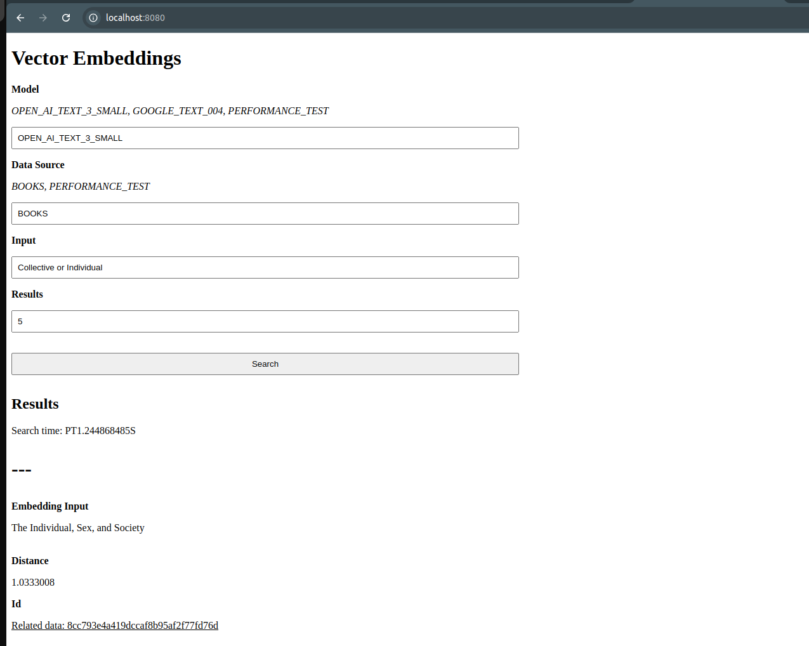

# Vector Embeddings with Postgres, the Everything Database

Let's experiment with Vector Embeddings with Postgres to see that it is indeed the Everything Database!

**What is there:**
* Postgres in Docker with [pgvector](https://github.com/pgvector/pgvector) extension installed
* Java 21 app that can:
  * generate OpenAI Embeddings - `OpenAIVectorEmbeddingsGenerator.java`
  * generate Google Embeddings - `GoogleVectorEmbeddingsGenerator.java`
  * use books from Kaggle dataset to demonstrate Semantic Search, possible by the usage of Vector Embeddings: https://www.kaggle.com/datasets/elvinrustam/books-dataset
  * generate *PerformanceTest Embeddings* to show the limits of not-indexed embeddings and how we can overcome it
* Various Bash scripts to automate operations and run them more smoothly

**What is needed to run it:**
* Docker
* Java 21 with compatible Maven version
* Bash shell
* OpenAI and GoogleAI API_TOKENS, to generate Vector Embeddings:
  * https://platform.openai.com
  * https://ai.google.dev

## Vector what?

Vector Embeddings are a simple yet profound concept.

We basically take any two pieces of information from the world - be it text, image or a video even - and turn them into a vector, a number of arbitrary dimensions (usually hundreds to a few thousand):
1. `[ 0.1, 0.2, 0.4 ]`
2. `[ 0.0, 0.1, 0.2 ]`

These vectors capture important features of the input: semantic meaning of the text or visual patterns for images, for example.

And then, we can measure how similar they are, simply by calculating a distance between them (Euclidean distance example, there are others as well):
```
sqrt((0.1 - 0.0)^2 + (0.2 - 0.1)^2 + (0.4 - 0.2)^2) = 0.244948974
```

## Generate Vector Embeddings

### Postgres

First, build and run Postgres. From the `postgres` dir:
```
bash build_and_run.bash
```
If you don't specify `VOLUME_DIR`, `${HOME}/vector_embeddings_db_volume}` is used.

### App

As said, Java 21 + compatible Maven version is needed. Once you have it, just run:
```
export GOOGLE_API_KEY=<your secret key or dummy value if you don't intend to use this API>
export OPEN_AI_API_KEY=<your secret key or dummy value if you don't intend to use this API>

bash build_and_run_vembeddings_app.bash
```
We can validate that it works by checking out API docs: http://localhost:8080/swagger-ui/index.html.

### Load books data

Go to https://www.kaggle.com/datasets/elvinrustam/books-dataset and download the dataset.
Once you have it, unzip it.

Then, we need to load it. How to do that? Simple, just run:
```
export DATA_BOOKS_FILE_PATH=<your path to BooksDataset.csv file>
bash load_data_for_vembeddings.bash
```

Server responds immediately, because it loads data in the background; in the logs you should see something like this:
```
2024-09-10T20:05:09.139+02:00  INFO 13582 --- [     virtual-51] c.b.v.VectorEmbeddingsController         : Loading BOOKS for embeddings data...
2024-09-10T20:05:13.130+02:00  INFO 13582 --- [     virtual-51] c.b.v.VectorEmbeddingsController         : BOOKS for embeddings data loaded, its size (might be different in db, if not unique): 103083
```
We have the data needed to test embeddings - let's generate them!

### OpenAI

Run:
```
bash generate_open_ai_vembeddings.bash
```

You might need to adjust a few environment variables, depending on your needs (mainly API rate limits):
```
skip="${VEMBEDDINGS_SKIP:-0}"
batch_size=${VEMBEDDINGS_BATCH_SIZE:-500}
rate_limit_delay=${VEMBEDDINGS_RATE_LIMIT_DELAY:-1000}
```
`VEMBEDDINGS_SKIP` allows to skip first N records - useful if you haven't finished generating embeddings and want to resume the process.
We make batch requests to OpenAI with `VEMBEDDINGS_BATCH_SIZE` embeddings at once - for details see `OpenAIVectorEmbeddingsGenerator.java`.
After every batch, we wait `VEMBEDDINGS_RATE_LIMIT_DELAY` ms so that we don't encounter rate limits.

In logs, you should see something like this:
```
2024-09-10T20:19:37.029+02:00  INFO 14257 --- [     virtual-51] c.b.v.embeddings.VectorEmbeddingService  : About to generate 101792 vector embeddings, using OPEN_AI_TEXT_3_SMALL model, skipping first 0 items with the batch size of 500 and rate limit delay 1000
2024-09-10T20:19:37.112+02:00  INFO 14257 --- [     virtual-51] c.b.v.embeddings.VectorEmbeddingService  : Generating and saving 500/101792 vector embeddings...
2024-09-10T20:19:43.806+02:00  INFO 14257 --- [     virtual-51] c.b.v.embeddings.VectorEmbeddingService  : Generating and saving 1000/101792 vector embeddings...
2024-09-10T20:19:50.044+02:00  INFO 14257 --- [     virtual-51] c.b.v.embeddings.VectorEmbeddingService  : Generating and saving 1500/101792 vector embeddings...
2024-09-10T20:19:56.197+02:00  INFO 14257 --- [     virtual-51] c.b.v.embeddings.VectorEmbeddingService  : Generating and saving 2000/101792 vector embeddings...
```

### Google Gemini Developer AI

Similarly to OpenAI, run:
```
bash generate_google_vembeddings.bash
```
In the same vein, you might need to adjust a few environment variables; they mean the same things as for OpenAI embeddings:
```
skip="${VEMBEDDINGS_SKIP:-0}"
batch_size=${VEMBEDDINGS_BATCH_SIZE:-50}
rate_limit_delay=${VEMBEDDINGS_RATE_LIMIT_DELAY:-500}
```

In logs, you should see something like this:
```
2024-09-10T20:33:20.192+02:00  INFO 14685 --- [     virtual-51] c.b.v.embeddings.VectorEmbeddingService  : About to generate 101792 vector embeddings, using GOOGLE_TEXT_004 model, skipping first 0 items with the batch size of 50 and rate limit delay 500
2024-09-10T20:33:20.247+02:00  INFO 14685 --- [     virtual-51] c.b.v.embeddings.VectorEmbeddingService  : Generating and saving 50/101792 vector embeddings...
2024-09-10T20:33:22.841+02:00  INFO 14685 --- [     virtual-51] c.b.v.embeddings.VectorEmbeddingService  : Generating and saving 100/101792 vector embeddings...
2024-09-10T20:33:24.728+02:00  INFO 14685 --- [     virtual-51] c.b.v.embeddings.VectorEmbeddingService  : Generating and saving 150/101792 vector embeddings...
2024-09-10T20:33:26.541+02:00  INFO 14685 --- [     virtual-51] c.b.v.embeddings.VectorEmbeddingService  : Generating and saving 200/101792 vector embeddings...
2024-09-10T20:33:28.417+02:00  INFO 14685 --- [     virtual-51] c.b.v.embeddings.VectorEmbeddingService  : Generating and saving 250/101792 vector embeddings...
```

### UI

Once we have that, we can go to http://localhost:8080 and play with the UI, searching for the books: 


\
Type something to see some interesting results! Here are some example inputs to get you started: 
* wartime experience
* The West
* Eastern story
* hierarchy
* artificial

...play with it, you will get a feel for it :)

## Performance

As you play with the UI, you will see that most searches take 1 to 2 seconds. This is the time it takes to:
* make a request to OpenAI/Google to generate embedding based on the user query
* use this embedding to query Postgres db in search for the most similar results

In the database, based on the books data, we have approximately `100 000` Vector Embeddings.

We can see that performance is good enough, but keep in mind that we make singular requests.
Without indexes, it will quickly break down. Let's see how!

Go to `load-test` dir and run the *LoadTest*:
```
export REQUESTS=50
export REQUESTS_PER_SECOND=2
export VEMBEDDINGS_MODEL=OPEN_AI_TEXT_3_SMALL
export VEMBEDDINGS_DATA_SOURCE=BOOKS

bash run.bash
```

This will run simple load test with only 2 requests per second rate; you should see something like this:
```
Starting LoadTest!

About to make 50 requests with 2/s rate to http://localhost:8080 host
Timeouts are 5000 ms for connect and 10000 ms for request
Max concurrency is capped at: 4

Endpoints to test (chosen randomly): 100

Model to test OPEN_AI_TEXT_3_SMALL with BOOKS data source

...

2024-09-11T20:47:32.890403863, 2/50 requests were issued, waiting 1s before sending next batch...
2024-09-11T20:47:33.891429502, 4/50 requests were issued, waiting 1s before sending next batch...
2024-09-11T20:47:41.904731322, 6/50 requests were issued, waiting 1s before sending next batch...

...

2024-09-11T20:49:15.445070655, 46/50 requests were issued, waiting 1s before sending next batch...
2024-09-11T20:49:16.445602023, 48/50 requests were issued, waiting 1s before sending next batch...

...

50 requests with 2 per second rate took PT1M56.934S

...

Executed requests: 50, with 2/s rate
Requests with connect timeout [5000]: 0, as percentage: 0
Requests with request timeout [10000]: 0, as percentage: 0

Min: 1.063 s
Max: 9.284 s
Mean: 6.766 s

Percentile 50 (Median): 7.249 s
Percentile 75: 8.205 s
Percentile 90: 9.043 s
Percentile 95: 9.215 s
Percentile 99: 9.284 s

...
```

90th percentile of over 9 second! That's some serious performance degradation with only 2 requests per second.

Let's index this table (using IVFFlat - Inverted File Index with Flat Quantization):
```
bash reindex_open_ai_books_vembeddings.bash
```

In the logs you should see:
```
2024-09-11T20:51:52.495+02:00  INFO 10670 --- [mcat-handler-57] c.b.v.VectorEmbeddingsController         : Reindexing IVFFlat table VectorEmbeddingTableKey[model=OPEN_AI_TEXT_3_SMALL, dataSource=BOOKS], it can take a while...
2024-09-11T20:52:00.947+02:00  INFO 10670 --- [mcat-handler-57] c.b.v.VectorEmbeddingsController         : Table VectorEmbeddingTableKey[model=OPEN_AI_TEXT_3_SMALL, dataSource=BOOKS] IVFFlat reindexed!
```

Let's run our *LoadTest* again, with increased load:
```
export REQUESTS=100
export REQUESTS_PER_SECOND=10
export VEMBEDDINGS_MODEL=OPEN_AI_TEXT_3_SMALL
export VEMBEDDINGS_DATA_SOURCE=BOOKS

bash run.bash
```

This time results are much, much better:
```
...

100 requests with 10 per second rate took PT12.412S

...

Executed requests: 100, with 10/s rate
Requests with connect timeout [5000]: 0, as percentage: 0
Requests with request timeout [10000]: 0, as percentage: 0

Min: 0.249 s
Max: 1.332 s
Mean: 0.38 s

Percentile 50 (Median): 0.331 s
Percentile 75: 0.377 s
Percentile 90: 0.52 s
Percentile 95: 0.698 s
Percentile 99: 1.332 s

...

```

Alright, that was for `100 000` Vector Embeddings but what about significantly more?

### Artificial Vector Embeddings to test the limits

Let's generate `1 000 000` *PerformanceTest Embeddings*!
They are artificial but quite realistic with 1536 dimensions - same as OpenAI ones (see `PerformanceTestVectorEmbeddingsGenerator.java` for details).
Run:
```
bash generate_performance_test_vembeddings.bash
```

This can take a while:
```
2024-09-11T20:59:26.090+02:00  INFO 10670 --- [    virtual-247] c.b.v.embeddings.VectorEmbeddingService  : About to generate 1000000 vector embeddings, using PERFORMANCE_TEST model, skipping first 0 items with the batch size of 1000 and rate limit delay 10
2024-09-11T20:59:26.118+02:00  INFO 10670 --- [    virtual-247] c.b.v.embeddings.VectorEmbeddingService  : Generating and saving 1000/1000000 vector embeddings...
2024-09-11T20:59:27.535+02:00  INFO 10670 --- [    virtual-247] c.b.v.embeddings.VectorEmbeddingService  : Generating and saving 2000/1000000 vector embeddings...
2024-09-11T20:59:28.934+02:00  INFO 10670 --- [    virtual-247] c.b.v.embeddings.VectorEmbeddingService  : Generating and saving 3000/1000000 vector embeddings...

...

2024-09-11T21:21:10.782+02:00  INFO 10670 --- [    virtual-247] c.b.v.embeddings.VectorEmbeddingService  : Generating and saving 998000/1000000 vector embeddings...
2024-09-11T21:21:12.032+02:00  INFO 10670 --- [    virtual-247] c.b.v.embeddings.VectorEmbeddingService  : Generating and saving 999000/1000000 vector embeddings...
2024-09-11T21:21:13.378+02:00  INFO 10670 --- [    virtual-247] c.b.v.embeddings.VectorEmbeddingService  : Generating and saving 1000000/1000000 vector embeddings...
2024-09-11T21:21:14.684+02:00  INFO 10670 --- [    virtual-247] c.b.v.embeddings.VectorEmbeddingService  : 1000000 vector embeddings generated and saved!
```

After we have it, let's run the *LoadTest* on our new vectors, without an index. 
Remember that since these artificial embeddings are generated in memory, it should be even faster:
```
export REQUESTS=25
export REQUESTS_PER_SECOND=2
export VEMBEDDINGS_MODEL=PERFORMANCE_TEST
export VEMBEDDINGS_DATA_SOURCE=PERFORMANCE_TEST

bash run.bash
```

Again, it was very slow; most of them didn't even make it (there is a timeout of 10 seconds):
```
...

25 requests with 2 per second rate took PT1M2.941S

...

Executed requests: 25, with 2/s rate
Requests with connect timeout [5000]: 0, as percentage: 0
Requests with request timeout [10000]: 25, as percentage: 100

Min: 10.0 s
Max: 10.044 s
Mean: 10.004 s

Percentile 50 (Median): 10.002 s
Percentile 75: 10.003 s
Percentile 90: 10.004 s
Percentile 95: 10.005 s
Percentile 99: 10.044 s

...
```
Let's restart the database and then create the IVFFlat Index again, which could take a while (a few, ten, minutes for this dataset):
```
bash reindex_performance_test_vembeddings_ivfflat.bash
```

Interestingly, you can observe the progress of creating this index by issuing a query:
```
SELECT phase, round(100.0 * blocks_done / nullif(blocks_total, 0), 1) AS "%" FROM pg_stat_progress_create_index;
               phase                | % 
------------------------------------+---
 building index: performing k-means |  
(1 row)

SELECT phase, round(100.0 * blocks_done / nullif(blocks_total, 0), 1) AS "%" FROM pg_stat_progress_create_index;
              phase               |  %  
----------------------------------+-----
 building index: assigning tuples | 6.1
```

Once the index is created, let's run the previous test again:
```
export REQUESTS=25
export REQUESTS_PER_SECOND=2
export VEMBEDDINGS_MODEL=PERFORMANCE_TEST
export VEMBEDDINGS_DATA_SOURCE=PERFORMANCE_TEST
bash run.bash
```

Results are great now, even though we have `1 000 000` rows in the table!
```
...

25 requests with 2 per second rate took PT13.694S

...

Executed requests: 25, with 2/s rate
Requests with connect timeout [5000]: 0, as percentage: 0
Requests with request timeout [10000]: 0, as percentage: 0

Min: 0.03 s
Max: 0.175 s
Mean: 0.074 s

Percentile 50 (Median): 0.068 s
Percentile 75: 0.08 s
Percentile 90: 0.094 s
Percentile 95: 0.174 s
Percentile 99: 0.175 s

...
```

Let's run a more serious test as well:
```
export REQUESTS=1000
export REQUESTS_PER_SECOND=50

bash run.bash
```

It handled it extremely well:
```
...

1000 requests with 50 per second rate took PT20.31S

...

Executed requests: 1000, with 50/s rate
Requests with connect timeout [5000]: 0, as percentage: 0
Requests with request timeout [10000]: 0, as percentage: 0

Min: 0.016 s
Max: 0.166 s
Mean: 0.027 s

Percentile 50 (Median): 0.024 s
Percentile 75: 0.029 s
Percentile 90: 0.04 s
Percentile 95: 0.048 s
Percentile 99: 0.072 s

...
```

\
**As we can see, Postgres with *pgvector* extension and with simple IVFFlat Index can easily handle 50 requests per second with the 99th percentile equal to 0.072 s, for the table of 1 000 000 rows.
So, it truly is the Everything Database!**


